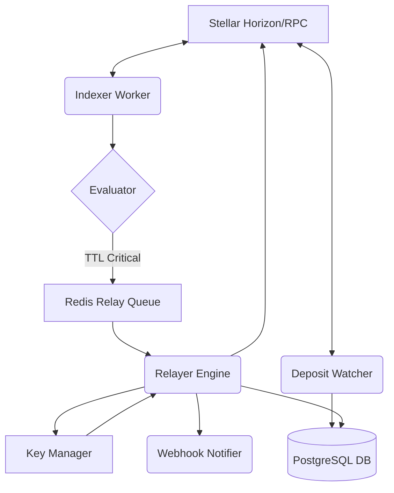

# Soroban RentWatch: Backend Architecture & Relayer Engine

## 1. Executive Summary

Soroban RentWatch is a mission-critical, off-chain infrastructure system designed specifically for the Stellar network's Soroban smart contract ecosystem. Its primary objective is to prevent state archival by automatically monitoring and extending the Time-To-Live (TTL) of registered smart contract data entries.

In the Soroban ecosystem, data stored on the ledger requires "rent" to be paid to maintain its presence in active state. If rent is not paid and the TTL expires, the state is archived, rendering the smart contract either partially or wholly inoperable until a complex and costly state-restoration transaction is performed. RentWatch acts as an automated insurance policy against this scenario.

By operating a multi-tenant relayer engine, RentWatch allows protocol developers to register their crucial contract footprints (Instance data, Persistent data, or Contract Code itself), fund a virtual balance pool, and completely offload the burden of TTL management. The system continually indexes the network, evaluates thresholds, and autonomously constructs, signs, and submits `ExtendFootprintTTL` transactions to keep the ecosystem healthy.

---

## 2. The Problem: Soroban State Archival

To fully understand the architecture of this backend, one must understand the underlying mechanics of Soroban state management.

### 2.1 Ledger Constraints and Rent
Stellar's state bloat is mitigated by introducing rent. Every piece of data written by a Soroban contract is assigned a TTL, measured in ledgers. As new ledgers close (approximately every 5 seconds), the TTL counts down.

### 2.2 Storage Types
RentWatch categorizes and monitors the three primary forms of Soroban state:
1. **Instance Storage:** Data associated directly with the contract instance. If archived, the contract is essentially bricked until restored.
2. **Persistent Storage:** Key-value pairs stored on behalf of users or the protocol. Critical for balances, governance state, or protocol configuration.
3. **Contract Code:** The compiled WASM binary itself. If the code expires, no one can invoke the contract.

### 2.3 The Archival Cliff
When the TTL reaches zero, the data is removed from the active ledger and moved into cold storage. Any attempt to access this data via contract invocation will result in a hard failure. Restoring this data requires a `RestoreFootprintOp`, which is significantly more expensive and complex than a preventative extension.

---

## 3. System Architecture

The Soroban RentWatch backend is not a monolithic script; it is a composition of several distinct, highly specialized micro-services running within a unified Node.js process. It leverages PostgreSQL for persistent, relational state, and Redis for high-throughput, low-latency queuing and locking.

### 3.1 High-Level Component Diagram



### 3.2 Core Micro-Services

#### 3.2.1 The Indexer Worker (`src/indexer/`)
The Indexer is the heartbeat of the system. Operating on a configurable cron schedule, it polls the Soroban RPC to fetch the current live TTL status of every registered key in the database.
- **Batch Processing:** To avoid rate-limiting from public or private RPC nodes, the Indexer chunks its requests into specific batch sizes.
- **Evaluator Logic:** Once the raw ledger data is fetched, the `evaluator.ts` module compares the current TTL against the user's defined `thresholdLedgers`. If the TTL falls below this threshold, the key is immediately flagged for extension.

#### 3.2.2 The Relayer Queue (`src/relayer/queue.ts`)
When a key requires extension, it is not executed immediately. Instead, it is pushed onto an asynchronous, Redis-backed processing queue.
- **Concurrency Control:** The queue ensures that we do not overwhelm the network or cause sequence number collisions.
- **Retry Mechanics:** If a network error occurs during transaction submission, the job is safely placed back in the queue with exponential backoff.

#### 3.2.3 The Relayer Engine (`src/relayer/engine.ts`)
The Relayer Engine pops jobs off the queue and executes the actual blockchain mutations.
- **Transaction Construction:** It builds a Soroban `ExtendFootprintTTLOp`, targeting the exact footprint of the expiring key.
- **Fee Estimation:** Using `src/relayer/fees.ts`, it dynamically calculates the required base fee and resource fees based on current network congestion.
- **Virtual Balance Deductions:** Before submission, it deducts the estimated XLM cost from the user's virtual `BalancePool` in PostgreSQL. If the user lacks funds, the transaction is aborted, and an "Insufficient Funds" webhook is triggered.

#### 3.2.4 The Deposit Watcher (`src/deposit/watcher.ts`)
To fund their virtual balance pools, users send real XLM to a centralized operational wallet, including a unique, database-generated memo string.
- **Horizon Streaming:** The Deposit Watcher maintains a persistent Server-Sent Events (SSE) connection to the Stellar Horizon API.
- **Cursor Management:** It utilizes `src/deposit/cursor.ts` to persistently track the last processed transaction, ensuring no deposits are missed during server restarts.
- **Automated Crediting:** When a transaction matches the operational wallet, it parses the memo, looks up the corresponding `User`, and credits their `BalancePool` with the exact XLM amount deposited.

#### 3.2.5 The Key Manager (`src/keys/`)
The operational wallets used by the Relayer Engine to sign transactions are highly sensitive.
- **AES-256-GCM Encryption:** Secret keys are never stored in plaintext. They are encrypted at rest using an AES-256-GCM cipher via `src/keys/crypto.ts`.
- **In-Memory Decryption:** Keys are only decrypted in memory at the exact moment of transaction signing.
- **Rotation and Selection:** The manager dynamically selects an available, non-busy relayer key to prevent sequence number conflicts when executing concurrent extensions.

#### 3.2.6 Webhook Notifications (`src/notifications/`)
When asynchronous events occur, the system must inform the developer.
- **Event Formatting:** `formatter.ts` standardizes event payloads into a predictable JSON structure.
- **Delivery:** `webhook.ts` executes POST requests to the user's configured endpoint, delivering alerts for Successful Extensions, Critical TTL Warnings, and Low Balance Alerts.

---

## 4. Database Schema Deep Dive

The system relies on Prisma ORM to interact with a PostgreSQL database. The schema is carefully designed for relational integrity and fast querying.

### 4.1 Models Overview

1. **User:** Represents a developer or protocol team. Stores their public key, unique deposit memo, and optional webhook URL.
2. **BalancePool:** A 1-to-1 relationship with `User`. Tracks their virtual XLM balance used to pay for automated extensions.
3. **MonitoredKey:** The core entity. Represents a specific Soroban footprint (Instance, Persistent, or Code) that the user wants to monitor. Tracks the `targetKeyXdr`, `thresholdLedgers`, `extendToLedgers`, and its current `TrackingStatus` (Healthy, Near Expiry, Critical).
4. **TransactionLog:** An immutable audit trail. Every time the Relayer Engine attempts an extension, a log is created recording the `txHash`, `xlmCost`, and success/failure status.
5. **DepositLog:** An immutable audit trail of every XLM deposit detected by the Deposit Watcher, mapped to the user via memo.
6. **RelayerKey:** The encrypted pool of operational wallets used to sign extension transactions.

### 4.2 Status State Machines

The `TrackingStatus` enum governs the lifecycle of a `MonitoredKey`:
- `HEALTHY`: The current TTL is well above the user's defined threshold.
- `NEAR_EXPIRY`: The TTL is approaching the threshold, but has not crossed it.
- `CRITICAL`: The TTL has crossed the threshold. The key is either queued for extension or actively failing to extend (e.g., due to insufficient user funds).
- `ARCHIVED`: The worst-case scenario. The key expired before rent could be paid.

---

## 5. Security Posture

Given that the backend manages private keys that hold XLM for transaction fees, security is paramount.

- **No Plaintext Secrets:** As detailed in the Key Manager section, all relayer secrets are encrypted via `crypto.createCipheriv('aes-256-gcm', ...)` before touching the database.
- **Authentication Tags:** The GCM mode generates an authentication tag, ensuring that the encrypted secret cannot be maliciously altered in the database without failing decryption.
- **Isolated Wallets:** The system is designed so that the "Deposit Wallet" (where user funds sit) and the "Relayer Wallets" (which sign transactions) can be logically separated, minimizing the blast radius of a compromised relayer key.
- **Parameter Validation:** All incoming XDR strings from the frontend are strictly validated before being parsed by the Soroban SDK to prevent injection attacks or memory exhaustion.

---

## 6. The User Lifecycle

From the perspective of the backend, a user goes through the following lifecycle:

1. **Registration:** The frontend API creates a `User` record. A unique 64-character hex `depositMemo` is generated.
2. **Funding:** The user sends 100 XLM to the operational wallet with their memo. The `DepositWatcher` detects this, creates a `DepositLog`, and increments the `BalancePool` by 100.
3. **Key Addition:** The user registers a `MonitoredKey`, providing the raw XDR of the ledger key and configuring it to extend to 100,000 ledgers whenever it falls below 15,000 ledgers.
4. **Monitoring:** The `IndexerWorker` polls this key every few minutes. For weeks, it remains `HEALTHY`.
5. **Trigger:** The TTL drops to 14,999. The Evaluator flags it.
6. **Execution:** The Relayer queue picks it up. It estimates the fee at 0.05 XLM. It deducts 0.05 from the user's `BalancePool`. It decrypts a `RelayerKey`, signs the transaction, and submits it to the network.
7. **Audit:** A `TransactionLog` is created. The user's webhook is hit with a success payload. The `MonitoredKey` is updated with its new, extended TTL and returns to `HEALTHY`.

---

## 7. Command Line Interface (CLI)

The backend ships with a powerful developer CLI located in `src/cli/index.ts`. This is used for administrative tasks that should not be exposed via a public API.

Available commands:
- `add-relayer-key`: Interactively prompts for a Stellar secret key, encrypts it using the environment secret, and stores it in the database for the Relayer Engine to use.
- `list-relayers`: Outputs a table of all configured relayer keys, their public addresses, and their active/retired status.
- `force-index`: Manually triggers an immediate cycle of the Indexer Worker, bypassing the cron schedule. Useful for debugging specific keys.
- `retry-failed-txs`: Sweeps the `TransactionLog` for recently failed transactions and re-queues them in Redis.

---

## 8. Directory Structure Breakdown

For developers contributing to this backend, understanding the folder hierarchy is crucial.

```text
src/
├── cli/             # Administrative command-line scripts
├── config/          # Centralized configuration parsing and typing
├── database/        # Prisma client initialization and Redis connection pooling
├── deposit/         # Horizon streaming logic and cursor persistence
├── indexer/         # Cron jobs for polling Soroban RPC and evaluating thresholds
├── keys/            # AES encryption, decryption, and relayer wallet selection
├── notifications/   # Outbound webhook formatting and delivery logic
├── relayer/         # The Redis queue, fee estimation, and Stellar transaction construction
├── utils/           # Shared utilities (Pino logger, formatters)
└── index.ts         # The main entry point orchestrating all background services
```

---

## 9. Performance & Scalability

The backend is engineered to scale horizontally where necessary.

- **Redis as a Coordinator:** Because the Relayer Engine uses Redis for its queue, you can spin up multiple instances of the backend process. Redis ensures that a single extension job is only processed by one worker, preventing duplicate transaction submissions.
- **Connection Pooling:** Prisma is configured with a connection pool to handle highly concurrent read/write spikes, particularly when the Indexer evaluates thousands of keys simultaneously.
- **Batching:** The Soroban RPC `getLedgerEntries` endpoint is queried in optimal chunks to maximize throughput while respecting public node rate limits.

---

## 10. Conclusion

Soroban RentWatch transforms the complex, manual process of Soroban TTL management into a seamless, "set-it-and-forget-it" infrastructure. By combining robust background processing, secure key management, and real-time blockchain streaming, it provides protocol developers with the absolute certainty that their smart contracts will remain active, operational, and safe from the archival cliff.
